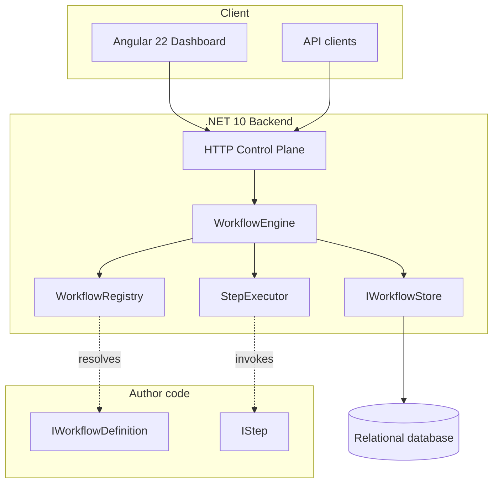
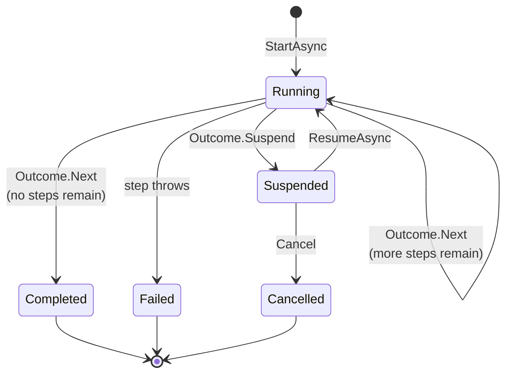
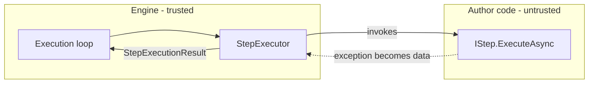
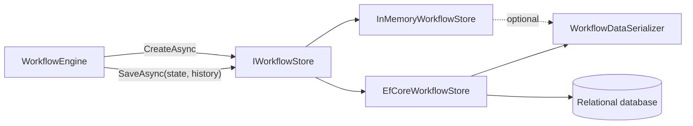

# FlowDeck — Architecture

> **Status:** describes what is built as of M4. Sections marked *Planned* are
> not implemented. Where the current implementation is knowingly inadequate,
> this document says so rather than describing the intended end state as if it
> existed.

## System shape



## Components

| Component | Responsibility | Status |
| --- | --- | --- |
| `IWorkflowDefinition` | Declares a workflow's identity and steps | ✅ M1 |
| `IWorkflowBuilder` | Collects declared steps in order | ✅ M1 |
| `WorkflowRegistry` | Resolves a definition by (id, version) | ✅ M1 |
| `IStep` | One unit of author-written work | ✅ M1 |
| `StepExecutor` | Runs one step; trust boundary | ✅ M1 |
| `WorkflowEngine` | Drives an instance through its steps | ✅ M1 |
| `WorkflowInstance` | State of one execution | ✅ M1 |
| `IWorkflowData` | Per-instance key-value state | ✅ M1 |
| `IWorkflowStore` | Durable instances and history | ✅ M2 |
| `WorkflowInstanceRecord` | Durable checkpoint form | ✅ M2 |
| `EfCoreWorkflowStore` | Relational persistence | ✅ M2 |
| `WorkflowDataSerializer` | Type-tagged data serialisation | ✅ M2 |
| `InstancePurger` | Retention sweeping | ✅ M2 |
| `WorkflowStoreMigrator` | Schema upgrade | ✅ M2 |
| HTTP control plane | Start, query, list, cancel over HTTP | ✅ M3 |
| Problem details | RFC 9457 error contract | ✅ M3 |
| OpenAPI document | Machine-readable API description | ✅ M3 |
| Health probes | Liveness and readiness | ✅ M3 |
| Dashboard | Angular 22 operator UI | ✅ M4 |

## Execution model

An instance advances one step at a time. Each step returns an `Outcome` that
tells the engine what to do next.



`Completed`, `Failed` and `Cancelled` are terminal. No operation moves an
instance out of them — see
[ADR-0008](adr/0008-terminal-states-are-final.md).

### The step loop

```
while there are steps remaining:
    position the instance on the current step
    execute it through StepExecutor
    if it failed        -> Failed, record error and step name, stop
    if it did not advance -> Suspended, stay on this step, stop
    advance to the next step
mark Completed
```

Two properties matter more than they look:

**The instance stays positioned on a suspending step.** Resume re-enters the
same step rather than skipping it. Advancing first would silently drop work.

**The failing step name is recorded separately from execution position.** Once
retries (M5) and compensation (M5) exist, position moves on after a failure;
the failure point must survive that.

## Key seams

These exist so later milestones can extend the engine without reshaping it.

| Seam | Introduced for | Used by |
| --- | --- | --- |
| `IWorkflowStore` | #16 | #17 EF Core provider; conformance suite is the contract |
| `TimeProvider` injection | #3 | #8 timestamp assertions, #20 retention |
| `IWorkflowData.Snapshot()` | #5 | #15 persisting workflow data |
| `IWorkflowDefinition.InputType` | #10 | #23 validating an HTTP request body |
| `StepExecutionResult` | #2 | #37 retry policy decisions |

## Trust boundaries



`StepExecutor` is the only place that catches. Everything a step can do wrong
becomes a `StepExecutionResult`, so the loop above never has to. The one
deliberate exception is `OperationCanceledException`, which is rethrown — see
[ADR-0004](adr/0004-cancellation-is-not-step-failure.md).

## Concurrency model

| Guarantee | Current status |
| --- | --- |
| One instance executes on one worker at a time | assumed, not enforced |
| Different instances may execute concurrently | ✅ supported and tested |
| Instance data is isolated per instance | ✅ enforced by construction |
| Registry lookup is thread-safe | ✅ `ConcurrentDictionary` |
| Instance store is thread-safe | ✅ locked in-memory; transactional in EF Core |
| A stale write is rejected rather than applied | ✅ `Revision` token, both providers |

`WorkflowInstance` and `WorkflowData` are deliberately **not** thread-safe.
A concurrent collection there would imply a guarantee the engine does not make.
Enforcing the single-worker invariant across nodes is M6's problem (#39).

## Persistence

Instances are checkpointed after every step. `WorkflowInstanceRecord` is the
authoritative state; `StepHistoryEntry` is an append-only log written in the
same operation. Recovery reads the record and never replays history — see
[ADR-0013](adr/0013-persistence-model.md).



| Concern | Where it is settled |
| --- | --- |
| Checkpoint vs event log | [ADR-0013](adr/0013-persistence-model.md) |
| Serialising author-defined data | [ADR-0014](adr/0014-workflow-data-serialisation.md) |
| Who owns migrations | [ADR-0015](adr/0015-migrations-are-owned-by-the-host.md) |
| Writing a provider | [guide](guides/writing-a-persistence-provider.md) |

**The conformance suite is the provider contract.** `IWorkflowStore` is only its
signature. It runs against three configurations — in-memory, in-memory with
serialisation, and EF Core on SQLite — plus opt-in runs against PostgreSQL and
SQL Server. It has already caught a SQLite
`ORDER BY` incompatibility that reading the code would not have.

### Recovery

A restart loses nothing but the process. `ResumeAsync` loads the record and
**recompiles steps from the registry**, so any host holding the same definitions
can continue an instance it never started.

Two properties this buys, both asserted:

- **A completed step is never re-executed.** The checkpoint after advancing is
  what NFR-1 rests on.
- **At most one step of progress is lost** in a crash. Verified by a store that
  stops accepting writes mid-run.

## Known limitations

Stated plainly, because an architecture document that hides them is worse than
none.

| Limitation | Consequence | Tracked by |
| --- | --- | --- |
| A crashed instance is stuck in `Running` | No sweep returns it to `Suspended`, so nothing resumes it | #39 |
| PostgreSQL and SQL Server conformance runs have never been executed | Both are supported by design and unverified in practice; the suites exist and skip | #78 |
| Resume requires the definition registered on the recovering host | An unknown definition cannot be resumed | #67 |
| A retry backoff blocks the calling thread | Only backoffs of seconds are usable; a long one holds an HTTP request open | #39 |
| No compensation | Partial work is not undone on failure | #38 |
| No coordination across external services | A workflow spanning services has no cross-service guarantee | #111 |
| Single node only | No multi-node coordination exists | #39 |
| Only cancel exists as an operator action | No retry, re-run, or bulk actions | #66 |
| Resume is not exposed over HTTP or the dashboard | A suspended workflow is only completable in-process | #68 |
| The dashboard has no paging controls | Only the newest 50 instances are reachable in the UI | — |
| Colour contrast is not verified by test | jsdom has no layout engine, so axe skips the rule | ADR-0016 |
| **No authentication** | Anything reachable can start, inspect and cancel workflows | #42 |
| Execution history is recorded but not exposed over HTTP | A dashboard cannot show a step timeline yet | — |
| No rate limiting | A client can start instances as fast as it can send | — |
| Nothing has been verified by CI | No self-hosted runner is registered; all results are local | — |

## Technology

| Layer | Choice | Notes |
| --- | --- | --- |
| Backend | .NET 10 (`net10.0`) | SDK pinned via `global.json` |
| Solution format | `.slnx` | .NET 10 XML format, not `.sln` |
| Tests | xUnit | 81 tests as of M1 |
| Frontend | Angular 22 | Not yet scaffolded |
| Persistence | PostgreSQL via EF Core | Planned, M2 |
| CI/CD | GitHub Actions, self-hosted runner | See [deploy](../deploy/README.md) |

## Repository layout

```
FlowDeck.slnx
global.json                     SDK pin
src/backend/FlowDeck.Core/      Engine
src/frontend/                   Angular app (M4)
tests/backend/                  xUnit tests
deploy/homelab/                 docker compose stack
docs/                           This documentation
.githooks/pre-commit            gitleaks secret scan
```

## Related documents

- [Requirements](requirements.md)
- [Implementation plan](implementation-plan.md)
- [Decision records](adr/README.md)
- [Defining a workflow](guides/defining-a-workflow.md)
- [Deployment](../deploy/README.md)
- [Security policy](../SECURITY.md)
