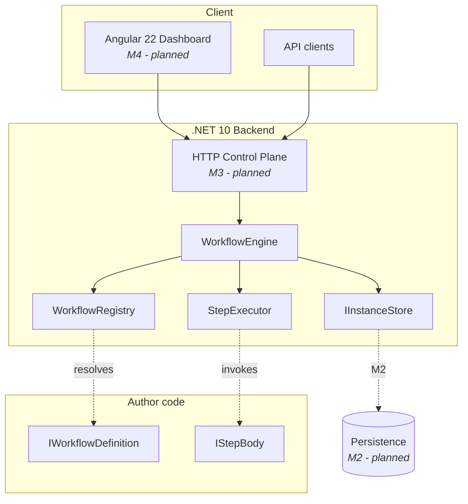
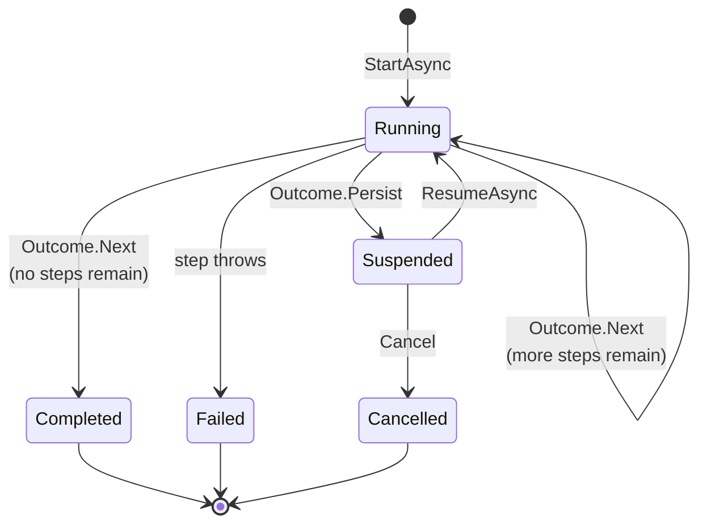
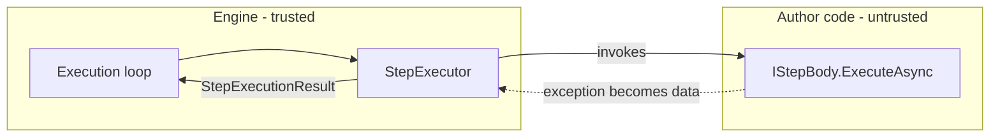

# FlowDeck — Architecture

> **Status:** describes what is built as of M1. Sections marked *Planned* are
> not implemented. Where the current implementation is knowingly inadequate,
> this document says so rather than describing the intended end state as if it
> existed.

## System shape



## Components

| Component | Responsibility | Status |
| --- | --- | --- |
| `IWorkflowDefinition` | Declares a workflow's identity and steps | ✅ M1 |
| `IWorkflowBuilder` | Collects declared steps in order | ✅ M1 |
| `WorkflowRegistry` | Resolves a definition by (id, version) | ✅ M1 |
| `IStepBody` | One unit of author-written work | ✅ M1 |
| `StepExecutor` | Runs one step; trust boundary | ✅ M1 |
| `WorkflowEngine` | Drives an instance through its steps | ✅ M1 |
| `WorkflowInstance` | State of one execution | ✅ M1 |
| `IWorkflowData` | Per-instance key-value state | ✅ M1 |
| `IInstanceStore` | Where instances are kept | ⚠️ in-memory only |
| Persistence provider | Durable instance state | ❌ M2 |
| HTTP control plane | Start, query, cancel over HTTP | ❌ M3 |
| Dashboard | Operator UI | ❌ M4 |

## Execution model

An instance advances one step at a time. Each step returns an `Outcome` that
tells the engine what to do next.



`Completed`, `Failed` and `Cancelled` are terminal. No operation moves an
instance out of them — see
[ADR-0008](adr/0008-terminal-states-are-final.md).

### The step loop

```
while there are steps remaining:
    position the instance on the current step
    execute it through StepExecutor
    if it failed        -> Failed, record error and step name, stop
    if it did not advance -> Suspended, stay on this step, stop
    advance to the next step
mark Completed
```

Two properties matter more than they look:

**The instance stays positioned on a suspending step.** Resume re-enters the
same step rather than skipping it. Advancing first would silently drop work.

**The failing step name is recorded separately from execution position.** Once
retries (M5) and compensation (M5) exist, position moves on after a failure;
the failure point must survive that.

## Key seams

These exist so later milestones can extend the engine without reshaping it.

| Seam | Introduced for | Used by |
| --- | --- | --- |
| `IInstanceStore` | #11 | #17 EF Core provider, #16 in-memory test double |
| `TimeProvider` injection | #3 | #8 timestamp assertions, #20 retention |
| `IWorkflowData.Snapshot()` | #5 | #15 persisting workflow data |
| `IWorkflowDefinition.InputType` | #10 | #23 validating an HTTP request body |
| `StepExecutionResult` | #2 | #37 retry policy decisions |

## Trust boundaries



`StepExecutor` is the only place that catches. Everything a step can do wrong
becomes a `StepExecutionResult`, so the loop above never has to. The one
deliberate exception is `OperationCanceledException`, which is rethrown — see
[ADR-0004](adr/0004-cancellation-is-not-step-failure.md).

## Concurrency model

| Guarantee | Current status |
| --- | --- |
| One instance executes on one worker at a time | assumed, not enforced |
| Different instances may execute concurrently | ✅ supported and tested |
| Instance data is isolated per instance | ✅ enforced by construction |
| Registry lookup is thread-safe | ✅ `ConcurrentDictionary` |
| Instance store is thread-safe | ✅ `ConcurrentDictionary` |

`WorkflowInstance` and `WorkflowData` are deliberately **not** thread-safe.
A concurrent collection there would imply a guarantee the engine does not make.
Enforcing the single-worker invariant across nodes is M6's problem (#39).

## Known limitations

Stated plainly, because an architecture document that hides them is worse than
none.

| Limitation | Consequence | Tracked by |
| --- | --- | --- |
| Instance store is in-memory | All instances lost on restart | #13, #14 |
| Instance store is unbounded | Memory grows without limit | #20 |
| Runtime state lives on the engine | `ResumeAsync` is single-process only | #14, #39 |
| No retry | Any step failure is terminal | #37 |
| No compensation | Partial work is not undone on failure | #38 |
| Single node only | No multi-node coordination exists | #39 |
| No authentication | Anything reachable can start workflows | #42 |
| CodeQL analyses nothing | Detected `languages: []` before code existed | revisit |

## Technology

| Layer | Choice | Notes |
| --- | --- | --- |
| Backend | .NET 10 (`net10.0`) | SDK pinned via `global.json` |
| Solution format | `.slnx` | .NET 10 XML format, not `.sln` |
| Tests | xUnit | 81 tests as of M1 |
| Frontend | Angular 22 | Not yet scaffolded |
| Persistence | PostgreSQL via EF Core | Planned, M2 |
| CI/CD | GitHub Actions, self-hosted runner | See [deploy](../deploy/README.md) |

## Repository layout

```
FlowDeck.slnx
global.json                     SDK pin
src/backend/FlowDeck.Core/      Engine
src/frontend/                   Angular app (M4)
tests/backend/                  xUnit tests
deploy/homelab/                 docker compose stack
docs/                           This documentation
.githooks/pre-commit            gitleaks secret scan
```

## Related documents

- [Requirements](requirements.md)
- [Implementation plan](implementation-plan.md)
- [Decision records](adr/README.md)
- [Defining a workflow](guides/defining-a-workflow.md)
- [Deployment](../deploy/README.md)
- [Security policy](../SECURITY.md)
