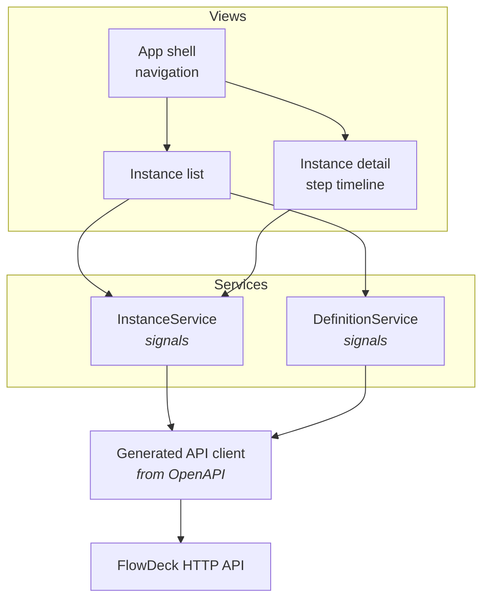

# Frontend architecture

> **Status:** planned for M4. Nothing here is built yet. This document exists
> because #62 requires the decisions settled *before* the dashboard, not after —
> the same process fix ADR-0016 and ADR-0017 exist for.

## Shape

**Components render. Services fetch.** No component touches `HttpClient`
directly — see [ADR-0018](adr/0018-frontend-state-management.md) for why that is
convention rather than structure, and what erodes it.

## Decisions

| Concern | Decision | Record |
| --- | --- | --- |
| Accessibility | WCAG 2.2 AA, axe-core in CI | [ADR-0016](adr/0016-accessibility-target.md) |
| Internationalisation | Mark text now, ship English only | [ADR-0017](adr/0017-internationalisation-stance.md) |
| State management | Signals and typed services | [ADR-0018](adr/0018-frontend-state-management.md) |
| Dependencies | Framework-native before third-party | [ADR-0010](adr/0010-minimise-third-party-dependencies.md) |

## The API client is generated

From the OpenAPI document (#28), not hand-written. A backend change that breaks
the contract then breaks the frontend build rather than surfacing as a runtime
error in front of an operator.

The cost is a regeneration step someone will forget. That is a smaller problem
than silent drift.

## Live updates

#36 requires the view to update without a manual refresh. **Polling first**, not
WebSockets or SSE:

- The engine has no change-notification mechanism, so push would mean building
  one — a larger design than the story asks for.
- A dashboard refreshing every few seconds is adequate for workflows measured in
  seconds to days.
- Polling degrades benignly. A dropped poll retries; a dropped socket needs
  reconnection logic, backoff and a resync strategy.

Revisit if an operator needs sub-second latency, which no story asks for.

## Octopus Deploy is the reference

The brief names it. What is worth taking:

- **Status is the primary visual element**, not a field in a row
- **The timeline is the detail view** — what ran, in order, with durations
- **Failures state where and why**, not merely that something failed
- Operator actions are present but deliberate, not one-click-destructive

What is not: its deployment-specific concepts, and its density. FlowDeck's
dashboard has four views, not forty.

## Known gaps before M4 can finish

| Gap | Blocks | Tracked |
| --- | --- | --- |
| **The API does not expose execution history** | #33's step timeline has no data source | — |
| No resume endpoint | A suspended instance cannot be continued from the UI | #68 |
| No authentication | The dashboard cannot show who did what | #42 |

The first is a hard blocker for #33 and needs an API endpoint before that story
can be built. Recording it here rather than discovering it mid-story.

## See also

- [HTTP API](api.md)
- [Architecture](architecture.md)
